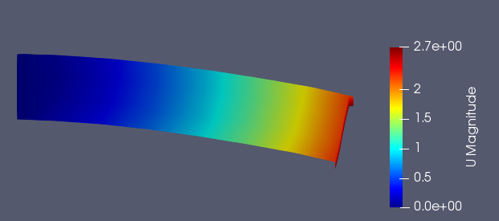
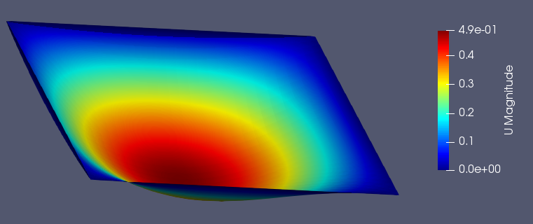
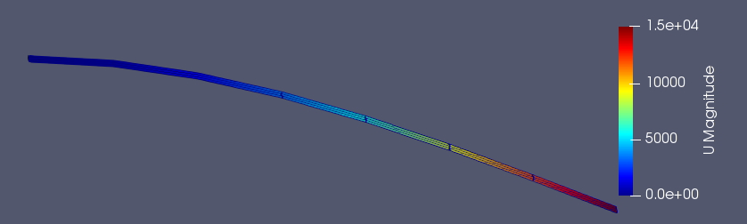

# Examples
All of the examples below are split into three parts. The first refers to the model creation. The second applies the boundary conditions to the model and finally the third defines the analysis type. 
## NURBS quadratic cantilever with distributed load.

The first example is a simple two-dimensional quadratic cantilever analyzed with the aid of **MSolve.IGA**.
The first code section reads an dcreates the model from file. The file can be found in **MSolve.IGA.Tests** project in the InputFiles folder.

```csharp
Model model = new Model();
ModelCreator modelCreator = new ModelCreator(model);
var filename = "Cantilever2D";
string filepath = $"..\\..\\..\\MGroup.IGA.Tests\\InputFiles\\{filename}.txt";
IsogeometricReader modelReader = new IsogeometricReader(modelCreator, filepath);
modelReader.CreateModelFromFile();
```

In the second part of the example the boundary conditions are applied. Initially a vertical load with magnitude 100 is defined and applied with the aid of a Neumann Boundary condition to the right edge of the model, which was automatically created during the model creation phase. In the next step all control points of the left edge are clamped.

```csharp
// Forces and Boundary Conditions
Value verticalDistributedLoad = (x, y, z) => new double[] {0, -100, 0};
model.PatchesDictionary[0].EdgesDictionary[1].LoadingConditions
    .Add(new NeumannBoundaryCondition(verticalDistributedLoad));

// Boundary Conditions
foreach (ControlPoint controlPoint in model.PatchesDictionary[0].EdgesDictionary[0].ControlPointsDictionary
    .Values)
{
    model.ControlPointsDictionary[controlPoint.ID].Constrains.Add(new Constraint() { DOF = StructuralDof.TranslationX });
    model.ControlPointsDictionary[controlPoint.ID].Constrains.Add(new Constraint() { DOF = StructuralDof.TranslationY });
}
```

The final step is the solution procedure. At first a solver is choosen, in this case, a Skyline one. Since the problem is of structural mechanics nature, the problem provider is defined as structural. Finally a Linear and Static analysis is defined and a paraview file with the displacements is generated. 

```csharp
var solverBuilder = new SkylineSolver.Builder();
ISolver solver = solverBuilder.BuildSolver(model);

// Structural problem provider
var provider = new ProblemStructural(model, solver);

// Linear static analysis
var childAnalyzer = new LinearAnalyzer(model, solver, provider);
var parentAnalyzer = new StaticAnalyzer(model, solver, provider, childAnalyzer);

// Run the analysis
parentAnalyzer.Initialize();
parentAnalyzer.Solve();

var paraview = new ParaviewNurbs2D(model, solver.LinearSystems[0].Solution, "QuadraticCantilever");
paraview.CreateParaview2DFile();
```

The output of the paraview file is illustrated in the figure at the end of this example.
 

## NURBS Beam3D
 The scond example is of a Beam 3D designed with NURBS. Once again the Isogeometric Reader is utilized to read the input file and create the model.
```csharp
Model model = new Model();
ModelCreator modelCreator = new ModelCreator(model);
string filename = "Beam3D";
string filepath = $"..\\..\\..\\InputFiles\\{filename}.txt";
IsogeometricReader modelReader = new IsogeometricReader(modelCreator, filepath);
modelReader.CreateModelFromFile();

```
In the second example we choose to apply a constant load of magnitude to the Control Points of the right face of the model while the right face is clamped.

```csharp
// Forces and Boundary Conditions
foreach (ControlPoint controlPoint in model.PatchesDictionary[0].FacesDictionary[1].ControlPointsDictionary.Values)
{
    model.Loads.Add(new Load()
    {
        Amount = -100,
        Node = model.ControlPointsDictionary[controlPoint.ID],
        DOF = StructuralDof.TranslationZ
    });
}

// Boundary Conditions
foreach (ControlPoint controlPoint in model.PatchesDictionary[0].FacesDictionary[0].ControlPointsDictionary
    .Values)
{
    model.ControlPointsDictionary[controlPoint.ID].Constrains.Add(new Constraint() { DOF = StructuralDof.TranslationX });
    model.ControlPointsDictionary[controlPoint.ID].Constrains.Add(new Constraint() { DOF = StructuralDof.TranslationY });
    model.ControlPointsDictionary[controlPoint.ID].Constrains.Add(new Constraint() { DOF = StructuralDof.TranslationZ });
}

```
The final step is the solution procedure. At first a solver is choosen, in this case, a Skyline one. Since the problem is of structural mechanics nature, the problem provider is defined as structural. Finally a Linear and Static analysis is defined and a paraview file with the displacements is generated. 
```csharp

// Solvers
var solverBuilder = new SkylineSolver.Builder();
ISolver solver = solverBuilder.BuildSolver(model);

// Structural problem provider
var provider = new ProblemStructural(model, solver);

// Linear static analysis
var childAnalyzer = new LinearAnalyzer(model, solver, provider);
var parentAnalyzer = new StaticAnalyzer(model, solver, provider, childAnalyzer);

// Run the analysis
parentAnalyzer.Initialize();
parentAnalyzer.Solve();

var paraview = new ParaviewNurbs3D(model, solver.LinearSystems[0].Solution, filename);
paraview.CreateParaviewFile();
```
In the following figure we see the output of the Paraview. 


## T-Splines 2D


## NURBS Square shell
In a similar fashion to the previous examples, a square shell is analyzed. Once again the model is read from a custom txt file. The difference with the previous examples is that the loads are read from a mat file and applied to the equivalanet Control Point dof.
```csharp
Model model = new Model();
var filename = "SquareShell";
string filepath = $"..\\..\\..\\MGroup.IGA.Tests\\InputFiles\\{filename}.txt";
IsogeometricShellReader modelReader = new IsogeometricShellReader(model, filepath);
modelReader.CreateShellModelFromFile();

Matrix<double> loadVector =
    MatlabReader.Read<double>("..\\..\\..\\MGroup.IGA.Tests\\InputFiles\\SquareShell.mat", "LoadVector");

for (int i = 0; i < loadVector.ColumnCount; i += 3)
{
    var indexCP = i / 3;
    model.Loads.Add(new Load()
    {
        Amount = loadVector.At(0, i),
        Node = model.ControlPointsDictionary[indexCP],
        DOF = StructuralDof.TranslationX
    });
    model.Loads.Add(new Load()
    {
        Amount = loadVector.At(0, i + 1),
        Node = model.ControlPointsDictionary[indexCP],
        DOF = StructuralDof.TranslationY
    });
    model.Loads.Add(new Load()
    {
        Amount = loadVector.At(0, i + 2),
        Node = model.ControlPointsDictionary[indexCP],
        DOF = StructuralDof.TranslationZ
    });
}

foreach (var edge in model.PatchesDictionary[0].EdgesDictionary.Values)
{
    foreach (var controlPoint in edge.ControlPointsDictionary.Values)
    {
        model.ControlPointsDictionary[controlPoint.ID].Constrains.Add(new Constraint() { DOF = StructuralDof.TranslationX });
        model.ControlPointsDictionary[controlPoint.ID].Constrains.Add(new Constraint() { DOF = StructuralDof.TranslationY });
        model.ControlPointsDictionary[controlPoint.ID].Constrains.Add(new Constraint() { DOF = StructuralDof.TranslationZ });
    }
}

// Solvers
var solverBuilder = new SkylineSolver.Builder();
ISolver solver = solverBuilder.BuildSolver(model);

// Structural problem provider
var provider = new ProblemStructural(model, solver);

// Linear static analysis
var childAnalyzer = new LinearAnalyzer(model, solver, provider);
var parentAnalyzer = new StaticAnalyzer(model, solver, provider, childAnalyzer);

// Run the analysis
parentAnalyzer.Initialize();
parentAnalyzer.Solve();

var paraview = new ParaviewNurbsShells(model, solver.LinearSystems[0].Solution, filename);
paraview.CreateParaview2DFile();
```

The desired paraview visualization is shown in the figure below.


## T-Spline Cantilever shell
In this T-Spline example a smal cantilever is analyzed with T-Splines. The data are read from a .iga file exported from Autodesk T-Spline plugin for Rhino. 
```csharp
Model model = new Model();
var filename = "CantileverShell";
string filepath = $"..\\..\\..\\MGroup.IGA.Tests\\InputFiles\\{filename}.iga";
IgaFileReader modelReader = new IgaFileReader(model, filepath);
modelReader.CreateTSplineShellsModelFromFile();

model.PatchesDictionary[0].Material = new ElasticMaterial2D(StressState2D.PlaneStress)
{
    PoissonRatio = 0.0,
    YoungModulus = 100
};
model.PatchesDictionary[0].Thickness = 1;

foreach (var controlPoint in model.ControlPointsDictionary.Values.Where(cp => cp.X < 3))
{
    model.ControlPointsDictionary[controlPoint.ID].Constrains.Add(new Constraint() { DOF = StructuralDof.TranslationX });
    model.ControlPointsDictionary[controlPoint.ID].Constrains.Add(new Constraint() { DOF = StructuralDof.TranslationY });
    model.ControlPointsDictionary[controlPoint.ID].Constrains.Add(new Constraint() { DOF = StructuralDof.TranslationZ });
}

foreach (var controlPoint in model.ControlPointsDictionary.Values.Where(cp => cp.X > 49.8))
{
    model.Loads.Add(new Load()
    {
        Amount = -0.5,
        Node = model.ControlPointsDictionary[controlPoint.ID],
        DOF = StructuralDof.TranslationZ
    });
}

var solverBuilder = new DenseMatrixSolver.Builder();
solverBuilder.DofOrderer = new DofOrderer(
    new NodeMajorDofOrderingStrategy(), new NullReordering());
ISolver solver = solverBuilder.BuildSolver(model);

// Structural problem provider
var provider = new ProblemStructural(model, solver);

// Linear static analysis
var childAnalyzer = new LinearAnalyzer(model, solver, provider);
var parentAnalyzer = new StaticAnalyzer(model, solver, provider, childAnalyzer);

// Run the analysis
parentAnalyzer.Initialize();
parentAnalyzer.Solve();

var paraview = new ParaviewTsplineShells(model, solver.LinearSystems[0].Solution, filename);
paraview.CreateParaviewFile();
```

The deflection of the shell cantilevers is shown using paraview in the figure below.
