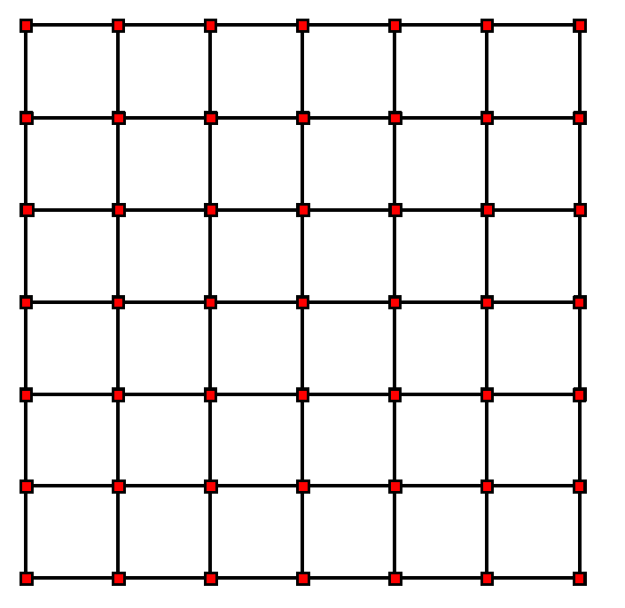

# Element Technology

A summary of basic elements provided in **MSolve.IGA** is provided.

## Continuum Elements
This element category contains structural mechanics isogeometric elements with only transitional degrees of freedom. In the case of Isogeometric Analysis which does approximate the geometry, elements are entities that can be created by deviding the patch utilizing existing CAD properties. For more information on Isogeometric Analysis please refer to [1].
### Nurbs Element 1D
In case of NURBS shape functions, one-dimensional elements are created utilizing the Knot Value Vector. For instance let given a knot value vector Ξ=\{ 0,0,0,1,2,3,4,5,6,6,6 \}.
Its unique values provide the Knots which in this example are:
{ 0,1,2,3,4,5,6 }. These values taken in consecutive pairs create the univariate Nurbs elements. The latter is illustrated in the figure below.

<p align="center">
  
</p>

An example on how to generated a NurbsElement1D is shown in the code below.
```csharp
Element element = new NurbsElement1D()
{
    ID = elementID,
	ElementType = new NurbsElement1D(),
	Patch = patch,
	Degree = 3,
	Model = model
};
element.AddKnots(knotsOfElement);
element.AddControlPoints(elementControlPoints);
```

### Nurbs Element 2D
An extension to two-dimensions is straight forward by tensor product of univariate elements as presented in the last section. The only diffence in this case is that four knots are needed to define an element. Their order is the following: (i,j) (i, j+1) (i+1, j) (i+1, j+1), where i,j are the univariate numbering of the knots per axis Ksi and Heta equivalently.

<p align="center">
  
</p>

```csharp
var element = new Elements.NurbsElement2D();
foreach (var controlPoint in ElementControlPoints)
	element.ControlPointsDictionary.Add(controlPoint.ID,controlPoint);
foreach (var knot in ElementKnots)
	element.KnotsDictionary.Add(knot.ID, knot);
```

### Nurbs Element 3D
An extension to three-dimensions is straight forward by tensor product of univariate elements as presented in the last section. The only diffence in this case is that eight knots are needed to define an element. 

```csharp
var element = new Elements.NurbsElement3D();
foreach (var controlPoint in ElementControlPoints)
	element.ControlPointsDictionary.Add(controlPoint.ID,controlPoint);
foreach (var knot in ElementKnots)
	element.KnotsDictionary.Add(knot.ID, knot);
```

### T-Spline Element 2D
These elements are a product of the Bezier extraction performed in [2] and link Bezier element with their T-Spline counterpart with the aid of the Bezier extractio operator. An example on creating such an element is provided below.

```csharp
var element = new TSplineElement2D(null)
{
	ID = elementID,
	Patch = _model.PatchesDictionary[0],
	ElementType = new TSplineElement2D(null),
	DegreeKsi = elementDegreeKsi,
	DegreeHeta = elementDegreeHeta,
	ExtractionOperator = extractionOperator
};
foreach (var t in connectivity)
    element.AddControlPoint(_model.ControlPointsDictionary[t]);
```

## Structural Elements
This element category contains structural elements, that can have other categories of degrees of freedom other than transitional based on the formulation hypotheses.
### Nurbs Kirchhoff-Love shell element
This type of element is based on the Kirchhoff-Love formulation provided in [3]. It utilized Nurbs shape functions for the analysis. A detailed approach of the kinematics of the element can be found in [3], yet the finite element produced for the linear formulation is provided.

<a href="https://www.codecogs.com/eqnedit.php?latex=K_{rs}^{int}&space;=\int_{A}\frac{&space;\partial&space;n}{\partial&space;u_s}:\frac{\partial&space;\epsilon}{\partial&space;u_r}&plus;\frac{&space;\partial&space;m}{\partial&space;u_s}:\frac{\partial&space;\kappa}{\partial&space;u_r}dA" target="_blank"></a>


```csharp
var element = new NurbsKirchhoffLoveShellElement();
patch.Material = new ElasticMaterial2D(StressState2D.PlaneStress)
{
	YoungModulus = 100,
	PoissonRatio = 0.3
};
foreach (var controlPoint in ElementControlPoints)
	element.ControlPointsDictionary.Add(controlPoint.ID, controlPoint);
foreach (var knot in ElementKnots)
	element.KnotsDictionary.Add(knot.ID, knot);
```

### T-Splines Kirchhoff-Love shell element
Similar element to the one presented above is this one with the difference that it is supported by T-Spline shell elements. In addition, besides the geometrically linear formulation, another formulation that allows the use of arbitrary non-linear 3D materials is used by performing a throught thickness integration. For information on the thickness integration please refer to [4].


```csharp
var element = new TSplineKirchhoffLoveShellElement()
{
    ID = elementIDCounter,
	Patch = _model.PatchesDictionary[0],
	ElementType = new TSplineKirchhoffLoveShellElement(),
	DegreeKsi = elementDegreeKsi,
	DegreeHeta = elementDegreeHeta,
	ExtractionOperator = extractionOperator
};
for (int cp = 0; cp < connectivity.Length; cp++)
	element.AddControlPoint(_model.ControlPointsDictionary[connectivity[cp]]);
```

### References
[1] [T.J.R. Hughes, J.A. Cottrell, Y. Bazilevs, Isogeometric analysis: CAD, finite elements, NURBS, exact geometry and mesh refinement, Computer Methods in Applied Mechanics and Engineering, Volume 194, Issues 39–41, 2005.](https://www.sciencedirect.com/science/article/pii/S0045782504005171)

[2] [M. Scott, T. Hughes, T. Sederberg, and M. Sederberg, “An integrated approach to engineering design and analysis using the Autodesk T-spline plugin for Rhino3d,” Adv. Eng. …, 2013.](https://www.oden.utexas.edu/media/reports/2014/1433.pdf)

[3] [J. Kiendl, K.-U. Bletzinger, J. Linhard, R. Wüchner, Isogeometric shell analysis with Kirchhoff–Love elements, Computer Methods in Applied Mechanics and Engineering, Volume 198, Issues 49–52, 2009, Pages 3902-3914](https://www.sciencedirect.com/science/article/pii/S0045782509002680)

[4] [Marreddy Ambati, Josef Kiendl, Laura De Lorenzis, Isogeometric Kirchhoff–Love shell formulation for elasto-plasticity, Computer Methods in Applied Mechanics and Engineering, Volume 340, 2018, Pages 320-339](https://www.sciencedirect.com/science/article/pii/S0045782518302688)

